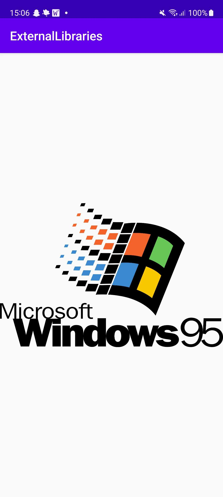
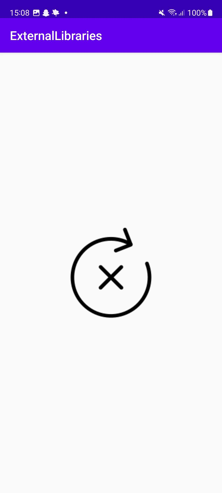
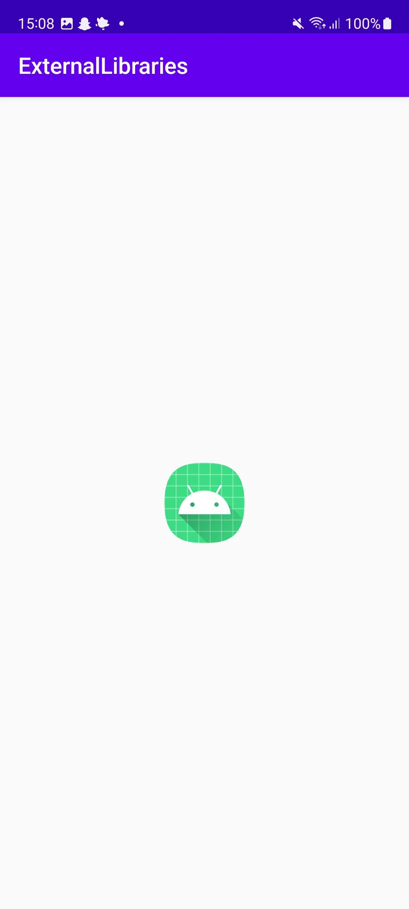

# Rapport

Denna applikation visar upp Windows 95 loggan. Lyckas inte bilden laddas in visas istället en
error bild. Innan applikation har lyckats eller inte med att ladda in loggan visas en placeholder.

## Följande grundsyn gäller dugga-svar:

Koden nedan ger applikation tillgång till internet.
```
<uses-permission android:name="android.permission.INTERNET"/>
```

Koden nedan implementerar Picasso.
```
implementation 'com.squareup.picasso:picasso:2.8'
```

Koden nedan hittar ImageViewn och laddar in bilden.
```
ImageView picassoImage = findViewById(R.id.picassoImage); // Finds the ImageView
        Picasso.get()
                .load("https://upload.wikimedia.org/wikipedia/commons/thumb/" + // Tries to load the
                        "4/44/Windows_95_stacked_logo.svg/2560px" +                 // image three times
                        "-Windows_95_stacked_logo.svg.png")
                .placeholder(R.mipmap.ic_launcher) // Placeholder that shows before the image is loaded
                                                    // or has failed to load
                .error(R.drawable.error) // Shows if the original image couldn't load after 3 tries
                .into(picassoImage); // Sets the image into the ImageView
```

Bilden nedan visar hur det ser ut när Windows 95 loggan lyckas ladda in.


När loggan inte lyckas ladda in.


Placeholder medan applikationen försöker ladda in bilden.
